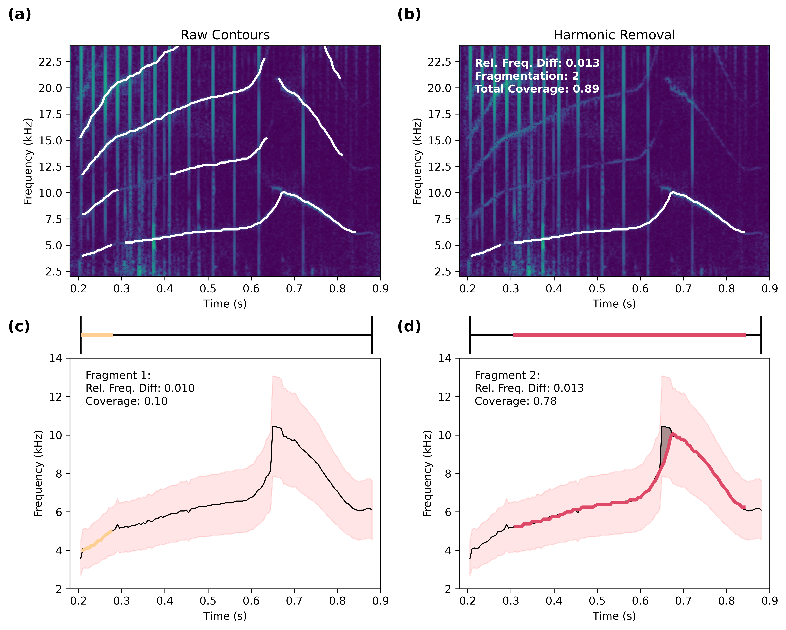
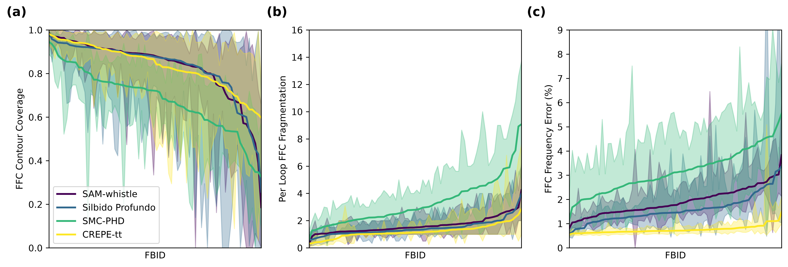
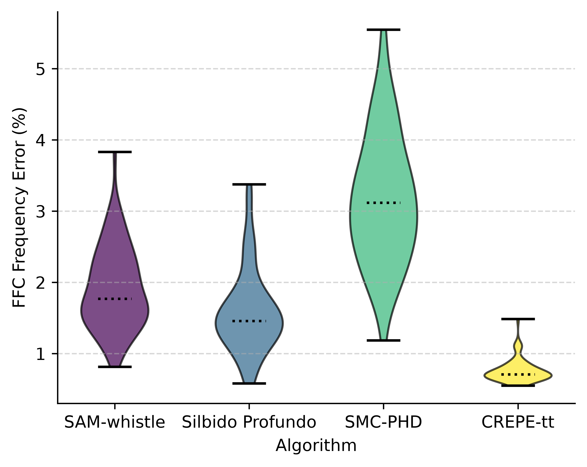
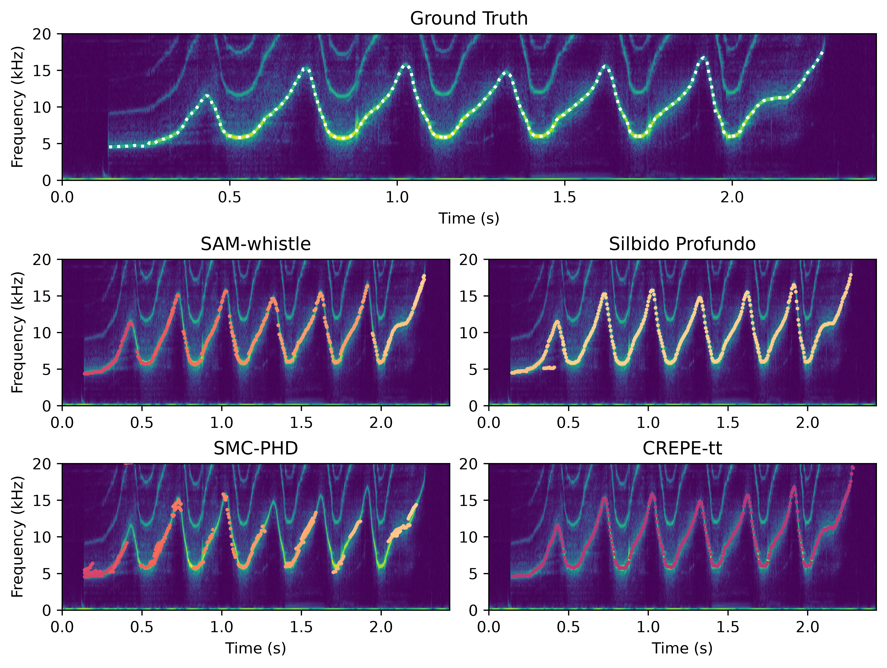
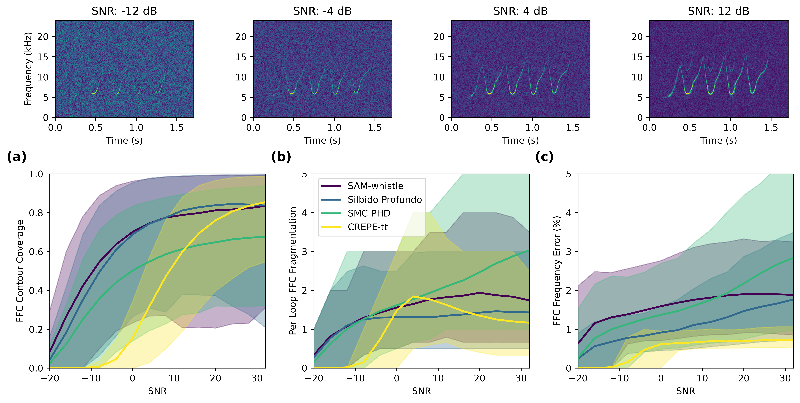
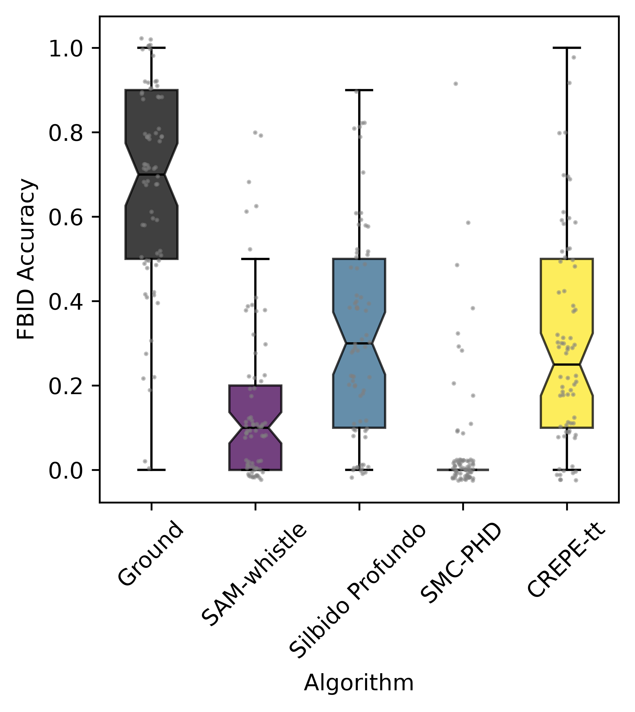

# ContourComparison

Automated contour extraction evaluation for bottlenose dolphin whistle monitoring.
Accompanies *Mind the Gap: Performance Limits of Automated Contour Extraction Methods for Individual Monitoring of Bottlenose Dolphins* (Tyarks et al. 2026). [DOI](https://doi.org/10.1111/mms.70263)

If this work is useful to you, please cite the original paper as follows:
```bibtex
@article{https://doi.org/10.1111/mms.70263,
author = {Tyarks, Saskia C. and Hyer, Matthew D. and Jensen, Frants H.},
title = {Mind the Gap: Performance Limits of Automated Contour Extraction Methods for Individual Monitoring of Bottlenose Dolphins},
journal = {Marine Mammal Science},
volume = {42},
number = {4},
pages = {e70263},
keywords = {acoustic individual identification, animal communication, conservation, deep learning, delphinids, population monitoring, signature whistle},
doi = {https://doi.org/10.1111/mms.70263},
url = {https://onlinelibrary.wiley.com/doi/abs/10.1111/mms.70263},
eprint = {https://onlinelibrary.wiley.com/doi/pdf/10.1111/mms.70263},
note = {e70263 8360962},
abstract = {ABSTRACT Reliable extraction of dolphin whistle contours is fundamental for scalable analyses of vocal identity, repertoire structure, and individual-based acoustic monitoring. We evaluated four algorithms for fundamental frequency estimation of common bottlenose dolphin (Tursiops truncatus) whistles, leveraging a benchmark dataset of annotated whistles from known animals to assess performance across individuals and as a function of signal-to-noise ratio (SNR). In high-SNR whistles (> 20 dB), the deep learning models CREPE-tt, SAM-whistle, and Silbido Profundo achieved similar performance in mean contour coverage (~80\%), with CREPE-tt producing the most continuous contours and the lowest frequency error. SAM-whistle and Silbido Profundo were more robust than CREPE-tt under low-SNR conditions. However, automatically extracted contours consistently reduced within- versus between-individual separation and ultimately decreased individual classification accuracy, highlighting how contour gaps and fragmentation propagate into downstream identity matching. Taken together, our results suggest a practical division: CREPE-tt excels with high-SNR data and detailed contour shape analyses without harmonic post-processing, whereas SAM-whistle and Silbido Profundo perform better with low-SNR recordings. For individual identification and abundance estimation, explicit SNR-based inclusion thresholds and quality-control criteria remain necessary.},
year = {2026}
}
```

This code is licensed under [MIT](LICENSE). The accompanying paper is
licensed under [CC-BY-4.0](https://creativecommons.org/licenses/by/4.0/).

## Installation

Requires **Python ≥ 3.9**.

```bash
git clone https://github.com/mdhyer/ContourComparison.git
cd ContourComparison
pip install -e ".[dev]"
```

### Optional extras

| Extra | Install | Enables |
|-------|---------|---------|
| CREPE (GPU) | `pip install -e ".[models]"` | CREPE contour extraction (requires PyTorch + CUDA) |
| MATLAB Engine | See [MathWorks docs](https://www.mathworks.com/help/matlab/matlab-engine-for-python.html) | Silbido Profundo, SMC-PHD, `.mat` ground truth loading |

> **Note:** The core pipeline (evaluation, metrics, plotting) runs without MATLAB or PyTorch. Precomputed contours are included in the example projects.

### Unpack example data

The various files needed to run the software are compressed within the `Projects` directory. Unpack the directories according to the [Directory Structure](#directory-structure--path-resolution) section below. A few example WAV files are provided for visualization, along with precomputed contours and metrics from each algorithm.

## Quick Start

```bash
# Launch the GUI
audio-analysis-gui
```

## Recreating Figures and Results
1. The easiest way to reproduce the results is to load an example project that comes with the package. Once the gui is open, use the right pane to select a project from the dropdown menu, then click `Load Example Project`
2. The precomputed evaluation results will not automatically load with the project, so next click on `Load Metrics` and select from the relevant results directory for that project.
3. Once the evaluation metrics are loaded, the gui is ready to go. Ensure the project root is assigned to the correct location on the left pane and the data has auto-discovered.

## Metrics Table
The metrics table tab holds evaluation results for the current configuration based on the evaluation metrics. Change the coverage mode, frequency difference mode, or fragmentation mode to explore the paper results for each project and configuration.

Each evaluation_metrics.json file stores the metrics for that specific project configuration. Benchmark: The Benchmark project has 3 configurations, with and without harmonic removal, and with or without the 20 db filtering described in the text.

In the Config Tab, the `Remove Harmonics` button can be unchecked to disable the feature during visualization. This will not change eval results, that change only occurs when the evaluation_metrics.json is changed.

## Visualization
The `Visualization` tab holds all of the visualization functionality. The visualization type can be selected from the dropdown menu and the relevant wav file can be selected via the `Browse` button. Plots are saved and created via the relevant buttons as well.

The Plot Controls dropdown menu holds many plot options for each visualization and can be used to select which algorithm is shown. Just change the names of the comma separated algorithms based on which algorithms are available in the metric table.

Below, the relevant visualizations and wav files for each figure can be found.

## Benchmark Dataset:
#### Figure 1.


Figure 1 can be mostly remade via the **Preprocessing** visualization using `F151-2006-SW-IND50654.wav`.

#### Figure 2



Figure 2 can be recreated using the **Metrics Mosaic v2** visualization and `F257-2015-SW-IND31349.wav`.

#### Figure 3



Figure 3 can be recreated using the **FBID Trends** visualization.

- Coverage Mode: `ffc`
- Freq Diff Mode: `ffc`
- Frag Mode: `ffc_per_loop`

#### Figure 4



Figure 4 can be recreated using the **Metric Violin** visualization and the **Frequency Difference** metric.

#### Figure 5



Figure 5 can be recreated using the **Spectrogram Overlay (Together)** visualization and `F151-2017-SW-IND19003.wav`.

### Fixed SNR Dataset

#### Figure 6



Figure 6 can be recreated using the **SNR Trends** visualization and `F151-2006-SW-IND50658_snr_0.wav`. Select any SNR level from the correct F151 folder; the tool will auto-select all SNR levels. To properly align the SNR visualizations and axis limits, use the **Plot Controls** dropdown and adjust the Spectrogram SNR Range and Axis Limits.

### Dynamic Time Warping

#### Figure 7



The DTW visualization is limited as we have not included all test files with the data. Please reach out for questions about the full dataset.

To recreate: select the **SingleLoop_DTW** project from the example projects and load the relevant `evaluation_metrics.json`. Navigate to the **DTW FBID Accuracy** tab, set N Ground Truth to 2 and N Comparisons to 1, then click **Run**.

## GUI

Launch with `audio-analysis-gui` or `python -m audio_analysis.gui`. The GUI is the primary interface for exploring results, adjusting parameters, and generating figures.

| Tab | Purpose |
|-----|---------|
| **Configuration** | Set project/data paths, select algorithms, adjust preprocessing (harmonic removal, contour splitting), and configure metric modes. Save/Load as JSON. |
| **Visualization** | Render SNR trends, FBID rankings, spectrogram overlays, and metric violins. Collapsible `Plot Controls` for axis limits, SNR ranges, and algorithm selection. |
| **Metrics Table** | Sortable table of aggregated metrics. Dropdowns switch between Coverage, Freq Diff, Fragmentation, and Recall modes. |
| **DTW FBID Accuracy** | DTW nearest-neighbor pipeline with Violin/Box plot toggle. |

## Directory Structure & Path Resolution

The pipeline uses a centralized configuration system that automatically resolves paths relative to your specified roots.

### Expected Directory Hierarchy

```text
project-root/
├── PrecomputeContours/
│   ├── CREPE/
│   │   ├── -12db/
│   │   │   ├── FBID_001/
│   │   │   └── FBID_002/
│   │   └── 20db/
│   └── Silbido Profundo/
├── Params/
│   ├── FBID_001/
│   │   └── whistle_0_params.mat
│   └── FBID_002/
├── data/
│   └── NoiseLevels/
│       ├── -12db/
│       │   ├── FBID_001/
│       │   └── FBID_002/
│       └── 20db/
└── results/
```

Flat Data (Single SNR, Raw data):
```text
project-root/
├── PrecomputeContours/
│   ├── CREPE/
│   │   └── data/
│   │       ├── FBID_001/
│   │       └── FBID_002/
│   └── Silbido Profundo/
├── Params/
│   ├── FBID_001/
│   │   └── whistle_0_params.mat
│   └── FBID_002/
├── data/
│   ├── FBID_001/
│   │   └── whistle_0.wav
│   └── FBID_002/
└── results/
```


**Configuration Files:**
- `pipeline_config.json`: Stores paths, algorithm settings, and metric modes. Auto-saved when you click **Save Config** in the GUI or use `--export-config` in the CLI.
- `evaluation_metrics.json`: Stores aggregated results. If a file already exists, the pipeline automatically appends a timestamp to avoid overwriting previous runs.

## Command-Line Interface (CLI)

The CLI is included for batch and headless use but is not required for the example projects. Please reach out with any questions if you are interested in using the tools with your own data.

## Testing

```bash
pytest -v
```

- Tests marked `@pytest.mark.matlab` are auto-skipped when `matlab.engine` is not installed.
- Run MATLAB tests explicitly: `pytest -m "matlab"` (requires MATLAB runtime on PATH).
- Benchmarks: `pytest tests/test_performance.py --benchmark-only`
- Coverage: `pytest --cov=src/audio_analysis --cov-report=term-missing`